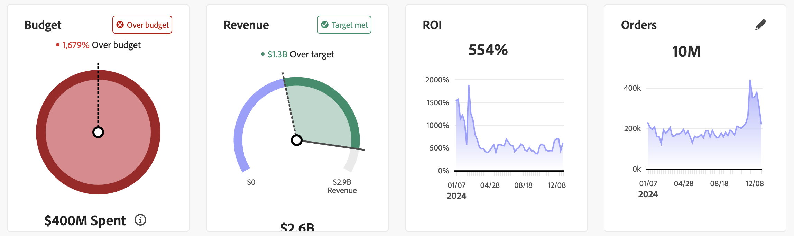

# Desempenho a planejar

>[!NOTE]
>
>A guia **[!UICONTROL Performance to plan]** [!BADGE Beta]{type=Informative} na  **[!UICONTROL Overview]** do Mix Modeler é um recurso beta e sua funcionalidade está sujeita a alterações. O recurso está disponível para um número limitado de clientes.

A guia **[!UICONTROL Plans]** [!BADGE Beta]{type=Informative} na  do Mix Modeler **[!UICONTROL Overview]** fornece um painel de rastreamento para monitorar o desempenho de seu marketing em relação ao plano. Você pode acompanhar o desempenho real em relação ao desempenho planejado por meio de cartões de status e visualizações.

O painel ajuda a identificar lacunas, detectar riscos ou oportunidades e fazer ajustes oportunos em seus planos e orçamentos.

Para selecionar quais dados são exibidos para os cartões de status e as visualizações de KPI:

* Selecione um plano no menu suspenso **[!UICONTROL Plan name]** usando **[!UICONTROL _Selecione uma opção..._]**.

* Especifique um período de data. Para alterar o período de data, insira uma data de início e uma data de término manualmente ou selecione um período de data usando .

A guia **[!UICONTROL Plans]** [!BADGE Beta]{type=Informative} mostra:

* [Cartões de status de KPI](#kpi-status-cards):

   * [Orçamento](#budget)
   * [Receita](#revenue)
   * [ROI](#roi)
   * [KPI](#kpi)

* [Visualizações](#visualizations):
   * [*Métrica*](#metric-actual-vs-planned)
   * [*Métrica*](#metric-actual-vs-planned-by-granularity)
   * [Canal ](#channel-metric-by-granularity)
   * [*Métrica*](#metric-vs-metric-by-channel)
   * [*Métrica*](#metric-by-granularity)
   * [*Métrica*](#metric-by-channel)

## Cartões de status de KPI

### Orçamento

Uma visualização circular de progresso que mostra como seu gasto com marketing se compara ao orçamento de seu plano para o período de data.

### Receita

Uma visualização circular do progresso que mostra como a receita real se compara à receita prevista para o período.

### ROI

Uma visualização de linha que mostra o ROI do período de data.

### KPI

Uma visualização de linha que exibe o KPI para o período de data.

Para selecionar outro KPI:

1. Selecione .
1. Na caixa de diálogo **[!UICONTROL KPI status card]**, selecione um KPI no menu suspenso **[!UICONTROL KPI]**. As opções disponíveis são: [!UICONTROL Conversions], [!UICONTROL CPA], [!UICONTROL Revenue], [!UICONTROL ROI] e [!UICONTROL Spend].

## Visualizações

Há seis visualizações disponíveis e você pode editar cada uma delas.

Para redimensionar uma visualização, use a alça ┛ no canto inferior direito. Para mover uma visualização, basta arrastar e soltar a visualização na posição preferencial.

Você pode passar o mouse sobre qualquer linha, barra ou elemento de dispersão em uma visualização para exibir um pop-up com informações adicionais.

### *Métrica*: real vs. planejada

Uma visualização de barras empilhadas que compara os valores de métrica selecionados para os totais, acumulados planejados e atualizados.

### *Métrica*: real vs. planejada por *granularidade*

Uma visualização de linha que mostra os valores reais e planejados para a métrica selecionada e a granularidade selecionada.

### *métrica* do canal por *granularidade*

Uma visualização de barras empilhadas que mostra barras empilhadas que exibem canais para a métrica selecionada e a granularidade selecionada.

### *Métrica* vs *Métrica* por canal

Uma visualização de dispersão que mostra um gráfico de dispersão para canais nas métricas selecionadas.

### *Métrica* por *granularidade*

Uma visualização de barra que mostra os valores reais e planejados para a métrica selecionada.

### *Métrica* por canal

Uma visualização de várias linhas que mostra a métrica selecionada sobre a granularidade selecionada.

### Editar uma visualização

Para editar uma visualização:

1. Selecione  para abrir a caixa de diálogo **[!UICONTROL Edit data]**.
1. Dependendo da visualização, você pode alterar:

   * Uma ou duas métricas: selecione uma métrica no menu suspenso **[!UICONTROL Select metric]**.

      * Para planos baseados no ROI, as opções são: [!UICONTROL Conversions], [!UICONTROL CPA], [!UICONTROL Revenue], [!UICONTROL ROI], [!UICONTROL Spend] e [!UICONTROL Volume].
      * Para planos baseados em CPA, as opções são: [!UICONTROL Conversions], [!UICONTROL CPA], [!UICONTROL Spend] e [!UICONTROL Volume].
   * **[!UICONTROL Granularity]**: Selecione **[!UICONTROL date ranges]** ou **[!UICONTROL week]** no menu suspenso **[!UICONTROL Granularity]**.

   Você verá em **[!UICONTROL Preview]** como as alterações são diferentes da visualização **[!UICONTROL Current]**.

1. Selecione **[!UICONTROL Apply]** para aplicar as alterações. Selecione **[!UICONTROL Cancel]** para cancelar qualquer alteração na visualização.
