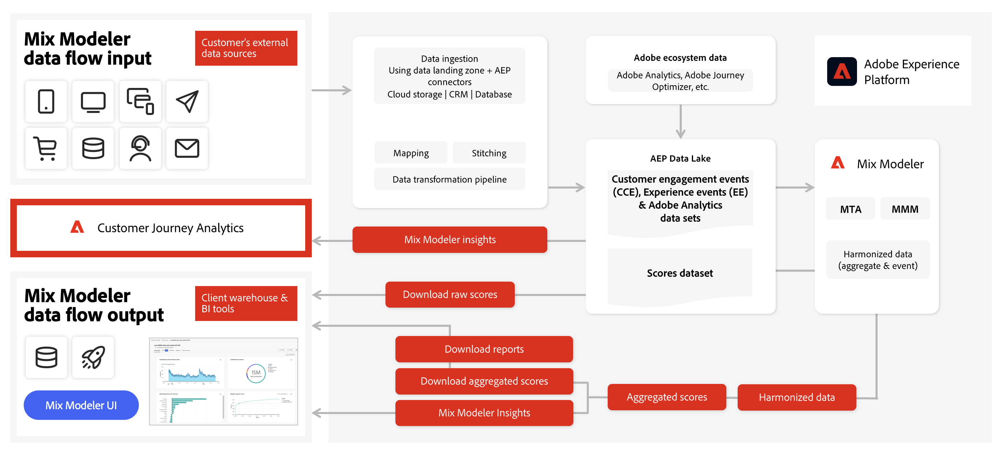

# Fluxo de trabalho do Mix Modeler

Veja este vídeo para obter uma introdução ao fluxo de trabalho do usuário no Mix Modeler.

>[!VIDEO](https://video.tv.adobe.com/v/3424854/?learn=on)

Um fluxo de trabalho típico no Mix Modeler consiste nas seguintes atividades:

|  | Atividade | Descrição |
|---|---|---|
| {width="100"} | [**Assimilar dados**](../ingest-data/overview.md) | Assimilar dados de eventos do Experience Platform (por exemplo, Adobe Analytics, Web SDK, outras fontes), dados agregados de canais de marketing (por exemplo, TV, jardins murados, email, atividades próprias e operadas), dados de fatores externos de clientes (por exemplo, alterações de preço no serviço de assinatura) e dados de fatores internos (por exemplo, planos de feriados). |
| {width="100"} | [**Harmonizar dados**](../harmonize-data/overview.md) | Configure regras de mapeamento e regras de resolução de conflitos para unir os vários conjuntos de dados de marketing necessários para medir e planejar o desempenho da campanha no Mix Modeler. |
| {width="100"} | [**Criar modelos**](../models/overview.md) | Crie instâncias de modelo com pontos de contato de marketing (por exemplo, canais), definições de conversão e fatores internos e externos. |
| {width="100"} | [**Treinar e pontuar modelos**](../models/overview.md) | Crie pontuações agregadas e em nível de evento usando treinamento e pontuação de aprendizado de máquina do. |
| {width="100"} | [**Criar planos**](../plans/overview.md) | Criar e construir planos. Determine a melhor alocação de fundos de marketing para atingir um objetivo comercial usando a saída dos modelos da Mix Modeler. |
| {width="100"} | [**Painel de visão geral**](../dashboard/overview.md) | Obtenha insights sobre dados, modelos e planos harmonizados usando várias visualizações configuráveis. |

{style="table-layout:auto"}

Uma visão geral de como os dados de entrada podem fluir para o Mix Modeler e como o Mix Modeler pode produzir dados de saída para sua própria interface, mas também para outras soluções, como o Customer Journey Analytics, é ilustrada abaixo.

<!--
The detailed data-oriented flowchart below illustrates how:

* harmonized data is based on:

  * experience event data (originating from Analytics source connector, collected through Experience Platform SDKs and APIs, ingested through source connectors, or using streaming ingestion),
  * aggregate or summary data from walled gardens (like Facebook, YouTube), traffic sources, or offline advertising data, and 
  * definitions of harmonized fields and dataset rules.

* a model is based on:

  * the conversion and marketing touchpoint definitions resulting from the harmonized data and 
  * non-marketing aggregate or summary data containing internal or external factors.

* mult-touch attribution event scores can potentially be fed back into Experience Platform data lake for use in subsequent model configuration, training and scoring.

-->
