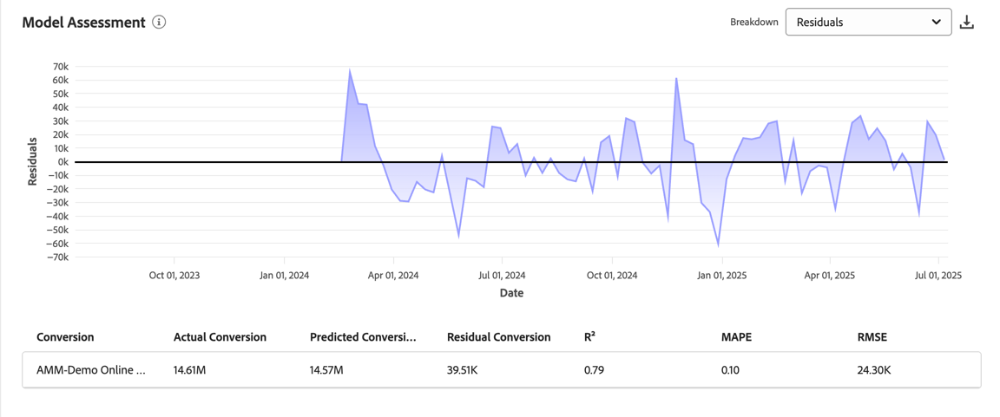
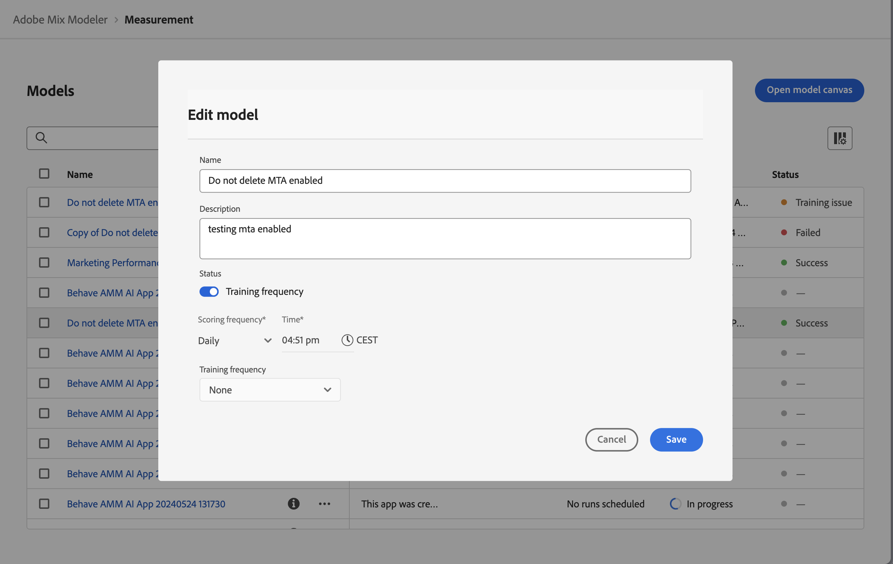

# Insights do modelo

Cada visualização em insights de modelo foi projetada para ajudar você a:

* Visualize e quantifique o impacto das atividades de marketing de sua organização.
* Identifique quais canais têm alto desempenho.
* Identifique quais canais podem precisar de otimização.

Esses insights ajudam a oferecer suporte à priorização e alocação de recursos.

Para exibir insights do modelo, na interface  **[!UICONTROL Models]** do Mix Modeler:

1. Na tabela **[!UICONTROL Models]**, selecione o nome de um modelo que tenha um **[!UICONTROL Last run status]** de ● **[!UICONTROL Success]**.

1. No menu de contexto, selecione **[!UICONTROL Model Insights]**.

As seguintes guias estão disponíveis:

* [Insights do modelo](#model-insights)
* [Fatores](#factors-beta) [!BADGE beta]
* [Atribuição](#attribution) (somente para modelos habilitados para MTA)
* [Diagnósticos](#diagnostics)
* [Visão geral histórica](#historical-overview).

É possível alterar o período de data no qual as visualizações em cada uma das guias se baseiam. Insira um período de data ou selecione  para selecionar um período de data.

## Desvio do modelo

{{release-limited-testing-section}}

Se for detectado um desvio de modelo no modelo, você verá uma caixa de diálogo **[!UICONTROL Model drift detected]** com opções para ser lembrada mais tarde ou para [**[!UICONTROL Retrain]**](overview.md#retrain) imediatamente o modelo. Se você selecionar **[!UICONTROL Remind me later]**, será lembrado no dia seguinte ou no próximo logon.

## [!UICONTROL Model insights]

A guia Informações do modelo mostra visualizações para [Contribuição por data e mídia base](#contribution-by-date-and-base-media), [Contribuição por canal](#contribution-by-channel), [Resumo do desempenho de marketing](#marketing-performance-summary) e [Curvas de resposta marginal](#marginal-response-curves). A guia também fornece uma tabela [Detalhamento do ponto de contato](#touchppint-breakdown).

* Você pode passar o mouse sobre elementos de gráficos individuais em cada visualização para exibir um popover com mais detalhes.

* Para baixar um arquivo CSV contendo os dados da visualização, selecione .

* Para baixar dados completos de insights do modelo no formato do Microsoft® Excel, selecione  **[!UICONTROL Download data]**.

### Contribuição por data e mídia base.

Essa visualização de gráfico empilhado é ordenada da seguinte maneira:

* A base é exibida na parte inferior.
* Os canais de não gastos são exibidos no meio.
* Os canais de gasto são exibidos na parte superior.

Essa visualização representa a proporção de contribuição obtida pela base, por canais de gastos e por canais não gastos em um intervalo de datas. Esta visualização é útil para mostrar a incrementalidade. A base representa o que teria acontecido sem qualquer marketing, e o atributo de canais não gastos mais canais gastos (sobre a base) do impacto do seu marketing. Em resumo, não gastar mais gastar equivale ao impacto incremental de seus esforços de marketing e a visualização fornece um insight fácil no valor gerado pelo marketing.

### Contribuição por canal

Uma visualização de rosca que mostra uma distribuição da contribuição por vários canais. Esta visualização mostra a incrementalidade através da lente dos três principais canais de desempenho (excluindo as categorias base e *Todos os outros*). A visualização ajuda a oferecer suporte à priorização e à alocação de orçamento.

### Resumo de desempenho de marketing.

Uma visualização de gráfico de barras horizontal que mostra o desempenho do ROI ou CPA de cada canal. Esta visualização destaca o ROI/CPA de seus investimentos em marketing. Os canais são classificados em ordem decrescente com base no ROI/CPA. A visualização ajuda a identificar quais canais são mais eficazes e quais podem precisar de otimização.

### Curvas de resposta marginal.

O gráfico de linhas visualiza e compara os retornos marginais gerados pelo investimento em seus canais de marketing.  E identifica o ponto de equilíbrio no qual o retorno incremental é menor do que o gasto incremental. Como resultado, essa visualização ajuda você a entender quando seu investimento em marketing começa a ter menos impacto.

A curva, o ponto de equilíbrio e os valores correspondentes são calculados com base no intervalo de dados selecionado e no canal selecionado.

Para alterar o canal:

* Selecione um canal no menu suspenso **[!UICONTROL Channel]** para atualizar a visualização de um canal específico.

### Detalhamento do ponto de contato

A tabela de detalhamento de ponto de contato mostra os detalhamentos semanais do ponto de contato para todos os canais ou para os canais selecionados, semanalmente, exibindo as métricas principais associadas a cada um. A tabela permite uma fácil comparação, identificação de tendências e rastreamento de desempenho em um nível de canal mais granular. Esta tabela complementa explicitamente a visualização [Contribuição por data e mídia base](#contribution-by-date-and-base-media) e a visualização [Contribuição por canal](#contribution-by-channel).

As seguintes colunas estão disponíveis:

| Coluna | Descrição |
|---|---|
| **[!UICONTROL Date range]** | A semana para relatar. |
| **[!UICONTROL Touchpoint]** | O canal de ponto de contato específico. |
| **[!UICONTROL ROI]** | A porcentagem de (**[!UICONTROL Revenue]** - **[!UICONTROL Spend]**) / **[!UICONTROL Spend]**. |
| **[!UICONTROL Revenue]** | A receita do intervalo de datas. |
| **[!UICONTROL CPA]** | **[!UICONTROL Spend]** / **[!UICONTROL Conversions]**. |
| **[!UICONTROL Conversions]** | As conversões do intervalo de datas. |
| **[!UICONTROL Spend]** | O gasto para o intervalo de dados. |

Para selecionar um canal específico ou todos os canais, selecione no menu suspenso **[!UICONTROL View]**.

Para baixar o conteúdo da tabela de detalhamento Touchpoint, selecione  **[!UICONTROL Download CSV]**.

## **[!UICONTROL Factors]** [!BADGE beta]

A guia Fatores [!BADGE beta] mostra insights relacionados ao fator externo.

Essa visualização ajuda você a entender o efeito incremental que vários fatores internos e externos têm na linha de base das conversões. Por exemplo, condições econômicas ou atividades promocionais.

Use o menu suspenso **[!UICONTROL Factors]** para selecionar quais fatores você deseja exibir.

<!-- need to update the image when we do have a proper example -->

Para baixar um arquivo CSV contendo os dados da tabela, selecione .

Se nenhum dado estiver disponível, você verá a mensagem  **[!UICONTROL No data is available, you may need to retrain your model, or change the date range to view insights]**.

## [!UICONTROL Attribution]

>[!NOTE]
>
>A guia Atribuição só está disponível para modelos habilitados para MTA.

Usando a guia [!UICONTROL Attribution], você pode entender a eficácia dos pontos de contato e campanhas de marketing que têm dados de nível de evento.  Consulte [Modelo de compilação](build.md).

Os seguintes modelos de atribuição são compatíveis:

* Com base no modelo selecionado no Mix Modeler:
   * Algorítmico - Influenciado
   * Algorítmico - Incremental
* Baseado em regra:
   * Unidades de decaimento
   * Primeiro contato
   * Último contato
   * Linear
   * Ushape

Consulte [Atribuição multitoque](../get-started/about.md#multi-touch-attribution) para obter uma introdução sobre o recurso de atribuição multitoque no Mix Modeler.

Selecione um ou mais modelos de atribuição no menu suspenso **[!UICONTROL Attribution Model]**. Os modelos de atribuição selecionados se aplicam a todas as visualizações na guia Atribuição.

As pontuações granulares do evento de atribuição multitoque do Mix Modeler são alinhadas às pontuações gerais e aos ROIs do Mix Modeler. Essas pontuações também são disponibilizadas como conjuntos de dados no Experience Platform.

A guia Atribuição consiste nas seguintes visualizações:

### [!UICONTROL Overview]

A visualização [!UICONTROL Overview] mostra, para os modelos de atribuição selecionados, os totais e as porcentagens de conversões. Selecionar mais modelos adiciona círculos adicionais à visualização, cada um com sua própria cor correspondente à legenda.

Para ver um pop-up com detalhes de um modelo de atribuição, passe o mouse sobre qualquer um dos círculos na visualização.

### [!UICONTROL Trends]

A visualização [!UICONTROL Daily trends], [!UICONTROL Weekly trends] ou [!UICONTROL Monthly trends] mostra, para os modelos de atribuição selecionados, as tendências de conversão diárias, semanais ou mensais.

Para escolher o período, selecione **[!UICONTROL Daily trends]**, **[!UICONTROL Weekly trends]** ou **[!UICONTROL Monthly trends]** de .

Para ver os detalhes, passe o mouse sobre a linha de dados de um modelo de atribuição específico para exibir um popover que mostra o número total de conversões desses dados.

### [!UICONTROL Breakdown]

A visualização [!UICONTROL Breakdown] é um detalhamento por canal ou ponto de contato das conversões para cada um dos modelos de atribuição selecionados. Essa visualização pode ser útil para tomar decisões sobre a eficácia de cada canal ou ponto de contato.

Para escolher o tipo de detalhamento, selecione **[!UICONTROL Breakdown by channel]** ou **[!UICONTROL Breakdown by touchpoint]** de .

Para ver detalhes, passe o mouse sobre qualquer um dos elementos do gráfico.

### [!UICONTROL Top campaigns]

A visualização Campanhas principais mostra uma tabela das campanhas principais com colunas para Nome da campanha, Canal, Tipo de mídia e Conversões incrementais. Essa visualização pode ajudar a informar sua equipe sobre a eficácia de uma campanha específica para um determinado canal e fornecer insights sobre em quais campanhas você deve investir ainda mais.

Para classificar a tabela em ordem crescente ↑ ou decrescente ↓ para Canal, Tipo de mídia ou Conversões incrementais, selecione o cabeçalho da coluna e alterne a classificação.

Para expandir a tabela em uma caixa de diálogo separada, selecione **[!UICONTROL Expand]** de .

A caixa de diálogo Campanhas principais expandida mostra a mesma tabela com colunas de adição para

* Conversões incrementais
* Conversões influenciadas
* Conversões de primeiro contato
* Conversões de último contato

  Você pode selecionar cada um dos cabeçalhos de coluna adicionais para classificar a tabela em ordem crescente ou decrescente.

Para fechar a caixa de diálogo Campanhas principais expandida, selecione **[!UICONTROL Close]**.

### [!UICONTROL Breakdown by touchpoint position]

A visualização [!UICONTROL Breakdown by touchpoint position] é um detalhamento das conversões atribuídas por posição do ponto de contato e do ponto de contato em todos os caminhos de conversão. Este gráfico ajuda a comparar se um ponto de contato contribui melhor em uma posição do que as posições restantes e outros pontos de contato em qualquer posição.

>[!NOTE]
>
>A soma da contribuição percentual para um modelo de atribuição em todos os pontos de contato e posições deve ser igual a 100.

As posições [!UICONTROL Starter], [!UICONTROL Player] e [!UICONTROL Closer] são definidas da seguinte maneira:

| Position | Descrição |
|---|---|
| [!UICONTROL Starter] | Essa posição indica se o ponto de contato é o primeiro contato em um caminho de conversão. |
| [!UICONTROL Player] | Essa posição indica se o ponto de contato não é o primeiro ou o último contato que leva à conversão. |
| [!UICONTROL Closer] | Essa posição indica se o ponto de contato é o último contato antes da conversão. |

### [!UICONTROL Top conversion paths]

A visualização [!UICONTROL Top conversion paths] mostra os 5 principais caminhos de conversão com base nos modelos de atribuição selecionados.

Para cada caminho de conversão, você verá:

* o número de canais que têm impacto,
* o total de caminhos atribuídos,
* a porcentagem de caminhos atribuídos para esse caminho de conversão em relação ao total de caminhos atribuídos,
* para cada canal, a porcentagem de contribuição do modelo de atribuição e
* a soma dessas porcentagens de contribuição do modelo de atribuição de canal.

## [!UICONTROL Diagnostics] {#diagnostics}

>[!CONTEXTUALHELP]
>id="models_diagnostics_modelassessment"
>title="Gráficos de avaliação do modelo"
>abstract="As visualizações de avaliação de modelo detalham as conversões reais versus previstas ou residuais."
>additional-url="https://experienceleague.adobe.com/pt-br/docs/mix-modeler/using/overview" text="Visão geral do Mix Modeler"
>additional-url="https://video.tv.adobe.com/v/3440794/?learn=on&amp;enablevpops" text="Demonstração do Mix Modeler"

>[!CONTEXTUALHELP]
>id="models_diagnostics_pathstouched"
>title="Caminhos tocados"
>abstract="Caminhos tocados é a porcentagem de caminhos que estão atingindo a conversão e a porcentagem de caminhos que não atingem a conversão para cada ponto de contato."

>[!CONTEXTUALHELP]
>id="models_diagnostics_modeldateinfo"
>title="Data do modelo em"
>abstract="Os dados desta tabela são gerados apenas para períodos específicos.  A data **[!UICONTROL As of]** indica quando os dados foram gerados e é baseada nos dados de startDate a endDate."

A guia **[!UICONTROL Diagnostics]** mostra visualizações para:

* **[!UICONTROL Model Assessment]** visualizações, que consistem em:

  

   * Um gráfico que pode ser detalhado em conversões reais versus previstas ou residuais.
Para detalhar a visualização, selecione uma das seguintes opções na lista **[!UICONTROL Breakdown]**.

      * **[!UICONTROL Actual vs Predicted]**: esta opção compara valores reais a previsões de modelo. Idealmente, os valores previstos devem se alinhar com os valores reais, embora seja esperado algum desvio. Desvios ou padrões grandes ou sistemáticos podem indicar relações e dados ausentes ou possíveis vieses.

      * **[!UICONTROL Residuals]**: esta opção mostra a diferença entre valores reais e previstos. Um modelo bem-sucedido tem resíduos que são distribuídos aleatoriamente, sem padrões claros ou aumento da disseminação. Tendências estruturadas ou alargamento de resíduos podem indicar relações ausentes e problemas de dados ou variância.

   * Uma tabela que mostra as seguintes colunas para cada métrica de conversão:

      * **[!UICONTROL Actual Conversion]**
      * **[!UICONTROL Predicted Conversion]**
      * **[!UICONTROL Residual Conversion]**
      * **[!UICONTROL R2]**, uma pontuação que informa como os dados se ajustam ao modelo de regressão (a adequação do ajuste).
      * **[!UICONTROL MAPE]** (Erro Percentual Absoluto Médio), que é um dos KPIs mais usados para medir a precisão da previsão e expressa o erro de previsão como uma porcentagem do valor real.
      * **[!UICONTROL RMSE]** (Erro de Média Quadrada de Raiz): que mostra o erro médio, ponderado de acordo com o quadrado do erro.

  Para baixar um arquivo CSV contendo os dados da tabela, selecione .

* Tabela **[!UICONTROL Model training fit metrics]**, que exibe para cada métrica de conversão:

  

   * **[!UICONTROL Training R2]**: indica a proporção de variação nos valores reais explicados pelas previsões do modelo, variando de 0 a 1.
   * **[!UICONTROL Training sMAPE]** (Erro de Porcentagem Absoluta Média simétrica): mede o erro de porcentagem média nos dados de treinamento. Valores mais baixos indicam melhor precisão.
   * **[!UICONTROL Training RMSE]** (Erro de Raiz Média Quadrada): Mede o erro de porcentagem média nos dados de treinamento. Penaliza mais erros maiores do que o MAPE. RMSE mais baixo sugere melhor precisão preditiva, mas é sensível a outliers.
   * **[!UICONTROL Out-of-sample sMAPE]**: Avalia a porcentagem de erro em dados não vistos, equilibrando previsões demais e inferiores. Ajuda a avaliar a generalização. Atualmente, o Mix Modeler avalia o erro percentual usando o último trimestre dos dados de treinamento como um conjunto de controle.
   * **[!UICONTROL Out-of-sample RMSE]**: Avalia a porcentagem de erro em dados não vistos, equilibrando previsões demais e inferiores. Ajuda a avaliar a generalização. Atualmente, o Mix Modeler avalia o erro percentual usando o último trimestre dos dados de treinamento como um conjunto de controle. O RMSE penaliza mais erros maiores do que o MAPE.

* Tabela **[!UICONTROL Touchpoint effectiveness]**, que representa o resultado do modelo algorítmico da IA de atribuição.

  

  Os dados desta tabela são gerados apenas para períodos específicos. Selecione **[!UICONTROL As of *xx/xx/xx, xx:xx TZ *]** para obter mais detalhes.

  A visualização mostra, em ordem decrescente de [!UICONTROL Efficiency measure] , para cada ponto de contato:

   * **[!UICONTROL Paths touched]**: visualiza a porcentagem de caminhos que atingem a conversão e a porcentagem de caminhos que não atingem a conversão. Para um ponto de contato, você verá mais conversões atribuídas quando a taxa de conversão de atribuição estiver alta. Essa proporção compara a porcentagem de caminhos que levam à conversão com a porcentagem de caminhos que *não* levam à conversão.
   * **[!UICONTROL Efficiency measure]**: gerada pelo modelo de atribuição algorítmica, a medida de eficiência indica a importância relativa de um ponto de contato em direção à conversão, independentemente do volume do ponto de contato. A eficiência é medida em uma escala de 1 a 5. Observe que um maior volume de pontos de contato não garante uma medida de eficiência mais alta.
   * **[!UICONTROL Total volume]**: O número agregado de vezes que um usuário toca um ponto de contato. O número inclui os pontos de contato que aparecem em um caminho que alcança a conversão, assim como os caminhos *não* que resultam na conversão.

### Detecção de desvio de modelo

>[!AVAILABILITY]
>
>A funcionalidade descrita nesta seção está na fase de Teste limitado da versão e pode ainda não estar disponível em seu ambiente. Essa nota será removida quando a funcionalidade estiver disponível no geral. Para obter informações sobre o processo de lançamento do Mix Modeler, consulte [versões de recursos do Mix Modeler](/help/releases/latest.md).
>

Se for detectado descompasso de modelo, você verá uma notificação **[!UICONTROL Model drift detected]** na parte superior.

Selecione **[!UICONTROL Hide]** para ocultar a notificação. A notificação reaparecerá no dia seguinte ou no próximo logon.

## [!UICONTROL Historical overview]

A guia Visão geral histórica mostra visualizações para:

### Conversão e gasto por trimestre fiscal e produto

Esta visualização representa a conversão e a distribuição de gastos em vários trimestres dentro do intervalo de datas especificado. A visualização ajuda a identificar trimestres de alto desempenho nos quais o gasto está gerando conversões.

### Gastos por canal

Esta visualização representa a distribuição de gastos em vários canais dentro do intervalo de datas especificado. A visualização permite a identificação rápida de quais canais recebem mais gastos.

### Gastos com Touchpoint

Esta visualização representa a distribuição de gastos em pontos de contato pagos para cada trimestre dentro do intervalo de datas especificado. A visualização permite compreender quais pontos de contato são priorizados em canais e trimestres específicos. A visualização ajuda a identificar padrões e tendências de gasto do canal, especialmente canais com gasto baixo e pouco frequente ao longo do tempo.

Para selecionar um canal alternativo com base em gastos a ser exibido para essa visualização:

* Selecione um canal de **[!UICONTROL Channels]**.

### Volume do ponto de contato

Essa visualização representa a distribuição do volume em todos os pontos de contato para cada trimestre dentro do intervalo de datas especificado.

Para selecionar um canal alternativo baseado em volume a ser exibido para essa visualização:

* Selecione um canal de **[!UICONTROL Channels]**.

## **[!UICONTROL Edit]**

É possível editar o nome, a descrição e a programação do treinamento e a pontuação do modelo.

1. Selecionar  Editar

1. No diálogo **[!UICONTROL Edit model]**:

   * Insira um(a) novo(a) **[!UICONTROL Name]** e **[!UICONTROL Description]**.

   * Para habilitar o agendamento, habilite **[!UICONTROL Status]**. Você só pode habilitar a programação para modelos treinados e pontuados.

      1. Selecione um **[!UICONTROL Scoring frequency]**:

         * **[!UICONTROL Daily]**: Insira uma hora válida (por exemplo `05:22 pm`) ou use .
         * **[!UICONTROL Weekly]**: Selecione um dia da semana e insira um horário válido (por exemplo `05:22 pm`) ou use .
         * **[!UICONTROL Monthly]**: Selecione um dia do mês no menu suspenso Executar em cada e insira um horário válido (por exemplo `05:22 pm`) ou use .

      1. Selecione um **[!UICONTROL Training frequency]** no menu suspenso: **[!UICONTROL Monthly]**, **[!UICONTROL Quarterly]**, **[!UICONTROL Yearly]** ou **[!UICONTROL None]**.

     

1. Selecione **[!UICONTROL Save]**.
