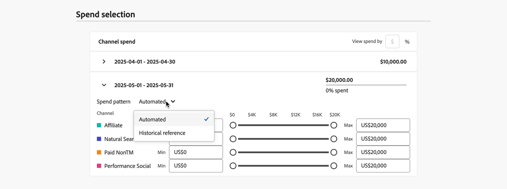

# Criar um plano

No Adobe Mix Modeler, é possível criar um plano usando a tela de plano. Na tela do plano, é possível configurar os detalhes e os orçamentos do plano e o modelo subjacente a ser usado para o plano. Depois de especificar os detalhes, o orçamento e o modelo, você pode seguir com um plano recomendado por IA ou editar o gasto por canal.

Para criar um plano, na interface  **[!UICONTROL Plans]** do Adobe Mix Modeler, selecione **[!UICONTROL Open plan canvas]**.

1. Na tela Plan creation:

   1. Na seção **[!UICONTROL Setup]**

      1. Insira um **[!UICONTROL Plan name]**, por exemplo `Demo plan`. Insira um **[!UICONTROL Description]**, por exemplo `Demo plan for Luma company`.
      1. Selecione um **[!UICONTROL Model]** de **[!UICONTROL _Selecione uma opção._.]**.
      1. Você pode selecionar  **[!UICONTROL Create model]** para criar um modelo diretamente de dentro da criação do plano.

         

   1. No **[!UICONTROL Budget]** seção:

      1. Especifique um intervalo de datas, digitando datas ou selecionando um intervalo de datas usando .
      1. Informe um orçamento.

      Para adicionar intervalos de datas adicionais, cada um com seu orçamento, selecione  **[!UICONTROL Add row]**.

      Para excluir um intervalo de datas e o orçamento associado, selecione .

      Para definir um orçamento máximo especificado:

      1. Ligar **[!UICONTROL Maximize budget]**.
      1. Especificar a quantidade do orçamento máximo. O valor deve ser igual ou superior ao valor total de orçamentos especificado para os intervalos de datas.

         

   1. Selecione **[!UICONTROL Next]**.

1. Na caixa de diálogo **[!UICONTROL Done with all required fields]**:

   

   * Selecionar  **[!UICONTROL Create plan now]** se você deseja gerar um plano recomendado de IA com ROI previsto.

     Selecione **[!UICONTROL OK]**. Seu plano foi criado.

   * Selecione  **[!UICONTROL Edit channel budgets first]** se desejar editar o orçamento do canal antes de criar um plano com ROI previsto.

     Selecione **[!UICONTROL OK]** para definir os gastos do canal em **[!UICONTROL Spend selection]** na próxima etapa.

1. Na seção **[!UICONTROL Spend selection]**, para cada intervalo de datas do orçamento, use a  para abrir a exibição de distribuição de canal para esse intervalo de dados.

   1. Para definir orçamentos para cada canal, insira um valor para **[!UICONTROL Min]** e **[!UICONTROL Max]** ou use os controles deslizantes.

   1. Para alternar entre entrada de moeda ou porcentagem, selecione **[!UICONTROL $]** ou **[!UICONTROL %]** para **[!UICONTROL View spend by]**.

      

   1. Quando terminar, selecione **[!UICONTROL Create]**.

   1. No **[!UICONTROL Create plan]** , selecione **[!UICONTROL Create plan]** para criar seu plano. Selecionar **[!UICONTROL Cancel]** para cancelar a criação do seu plano.

