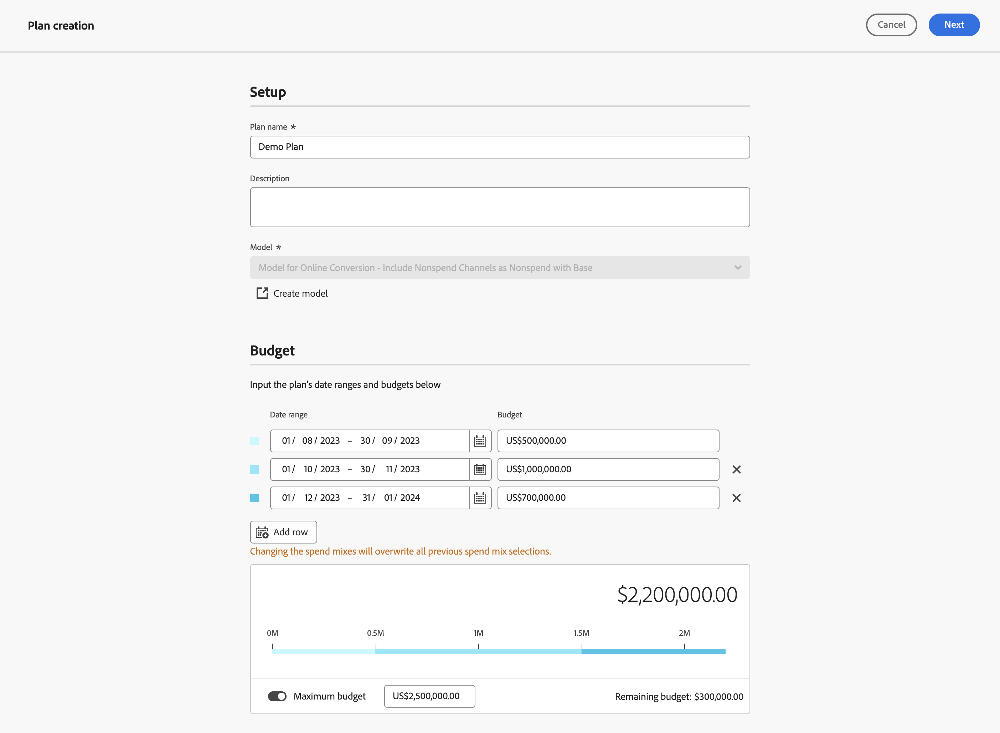

# Editar um plano

Para editar um plano, na  **[!UICONTROL Plans]** em Mix Modeler, selecione seu plano pelo nome.

Entrada [!UICONTROL Plan insights], os insights do plano são criados, mostrando a [!UICONTROL Model], o [!UICONTROL Data range], e [!UICONTROL Total budget] em que o plano se baseia.

Quando terminar de recuperar, você verá uma visão geral do seu plano, que consiste em:

- [!UICONTROL Forecasted paid channel ROI] visualização
- [!UICONTROL Forecasted revenue] visualização
- [!UICONTROL Data range breakdown] tabela do plano, mostrando colunas para

   - Canal
   - ROI
   - CPA
   - Receita
   - Meta de conversão
   - Gastos

1. Selecionar **[!UICONTROL Close]** para retornar à interface Planos.

1. Selecionar **[!UICONTROL X]** ou **[!UICONTROL  %]** sobre como **[!UICONTROL View ROI]**.

1. Para baixar um arquivo CSV com os dados do detalhamento de Intervalo de datas, selecione  **[!UICONTROL Download CSV]**.

1. Para exibir o detalhamento de Intervalo de datas por categoria de canais, selecione **[!UICONTROL All channels]**, **[!UICONTROL Paid channels]** ou **[!UICONTROL Non-paid channels]** do **[!UICONTROL View]** seleção.

1. Para editar o plano, selecione **[!UICONTROL Edit plan]**:

   1. No **[!UICONTROL Spend selection]** para cada intervalo de datas do orçamento, use o  para abrir a exibição de distribuição de canal para esse intervalo de dados.

   1. Para modificar os orçamentos de cada canal, modifique os valores de **[!UICONTROL Min]** e **[!UICONTROL Max]** ou use os controles deslizantes.

   1. Para alternar entre entrada de moeda ou porcentagem, selecione **[!UICONTROL $]** ou **[!UICONTROL %]** para **[!UICONTROL View spend by]**.

      

   1. Para editar os detalhes do seu plano, selecione **[!UICONTROL Edit details]**:

      1. No **[!UICONTROL Setup]** se aplicável, modifique a **[!UICONTROL Plan name]** e a variável **[!UICONTROL Description]**.

      1. No **[!UICONTROL Budget]** seção:

         1. Modifique o **[!UICONTROL Date range]** para um ou mais intervalos de datas do seu plano, digitando datas ou selecionando um intervalo de datas usando .

         1. Modifique o **[!UICONTROL Budget]** para um ou mais intervalos de datas do seu plano.

         Para adicionar intervalos de datas adicionais, cada um com seu orçamento, selecione  **[!UICONTROL Add row]**.

         Para deletar um intervalo de datas e o orçamento associado, selecione .

         Para definir um orçamento máximo:

         1. Alternar **[!UICONTROL Maximize budget]** em.
         1. Especificar a quantidade do orçamento máximo. O valor deve ser igual ou superior ao valor total de orçamentos especificado para os intervalos de datas.

      1. Selecionar **[!UICONTROL Next]** para retornar ao **[!UICONTROL Spend]** seção. Selecionar **[!UICONTROL Cancel]** para voltar à visão geral de seus planos.

         

1. Quando terminar de editar o plano, selecione **[!UICONTROL Edit]**.

   No **[!UICONTROL All changes are final]** , selecione **[!UICONTROL OK]** para atualizar a alocação de gastos atual do plano e as previsões de ROI e receita. Selecionar **[!UICONTROL Cancel]** para cancelar a atualização do seu plano.

1. Para cancelar as atualizações do plano, selecione **[!UICONTROL Cancel]**.

   No **[!UICONTROL No work will be saved]** , selecione **[!UICONTROL Cancel]** para continuar trabalhando no seu plano ou selecione **[!UICONTROL OK]** para retornar à interface Planos.
