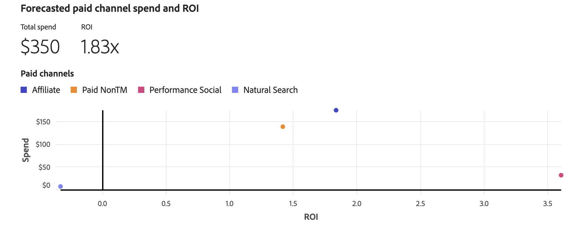

# Planejar insights

Em [!UICONTROL Plan insights], os insights do plano são criados, mostrando o [!UICONTROL Model], o [!UICONTROL Data range] e o [!UICONTROL Total budget] nos quais o plano se baseia.

Quando terminar de recuperar, você verá uma visão geral do seu plano, que consiste em:

- Visualização [!UICONTROL Forecasted paid channel ROI]
- Visualização [!UICONTROL Forecasted revenue]
- Visualização [!UICONTROL Forecasted conversion]
- Visualização [!UICONTROL Marginal channel return]
- Tabela [!UICONTROL Data range breakdown] do plano, mostrando colunas para

   - Canal
   - ROI
   - CPA
   - Receita
   - Meta de conversão
   - Gastos

Para fechar a interface, selecione **[!UICONTROL Close]**.

Para alterar como visualizar o ROI do seu plano, selecione **[!UICONTROL X]** ou **[!UICONTROL &#x200B; %]** em **[!UICONTROL View ROI]**.

## Gastos e ROI previstos do canal pago

Essa visualização mostra um gráfico de dispersão para o gasto previsto e o retorno do investimento em seus canais pagos, com base no modelo, intervalo de datas e orçamento.

## Receita prevista

Essa visualização de gráfico de barras mostra a receita prevista para seus canais com base no modelo, intervalo de datas e orçamento.

## Conversões previstas

Essa visualização de gráfico de barras mostra as conversões previstas para seus canais com base no modelo, intervalo de datas e orçamento.

## Retorno de canal marginal

Esta visualização de gráfico de linhas mostra uma curva de retorno marginal para o canal selecionado com indicadores para **[!UICONTROL Marginal break-even]** e **[!UICONTROL Return point]**. Essa visualização ajuda você a entender como gastar um canal é alcançar um ponto de equilíbrio marginal e se você tem espaço para aumentar o gasto em um canal ou gastar menos em um canal para melhorar a eficiência do gasto do canal.

Para selecionar um canal específico para a visualização, selecione um canal no menu suspenso **[!UICONTROL View]**.

## Detalhamento do intervalo de datas

A tabela [!UICONTROL Date range breakdown] mostra dados detalhados granulares por canal para [!UICONTROL ROI], [!UICONTROL Revenue], [!UICONTROL CPA], [!UICONTROL Conversions] e [!UICONTROL Spend].

1. Para baixar um arquivo CSV contendo os dados do detalhamento de intervalo de datas, selecione  **[!UICONTROL Download CSV]**. No menu de contexto:

   - Selecione  **[!UICONTROL Detailed CSV]** para obter dados detalhados em formato CSV.
   - Selecione  **[!UICONTROL Summary CSV]** para dados de resumo em formato CSV.

   Dados detalhados são dados granulares registrados por semana. Os dados de resumo são dados digitados pelo intervalo de datas fornecido pelo modelo.

1. Para exibir o detalhamento de Intervalo de datas por categoria de canais, selecione **[!UICONTROL All channels]**, **[!UICONTROL Paid channels]** ou **[!UICONTROL Non-paid channels]** na seleção **[!UICONTROL View]**.

## Editar plano

1. Para editar seu plano, selecione  **[!UICONTROL Edit plan]**:

   1. Na seção **[!UICONTROL Spend selection]**, para cada intervalo de datas do orçamento, use a  para abrir a exibição de distribuição de canal para esse intervalo de dados.

   1. Para modificar os orçamentos de cada canal, modifique os valores de **[!UICONTROL Min]** e **[!UICONTROL Max]** ou use os controles deslizantes.

   1. Para alternar entre entrada de moeda ou porcentagem, selecione **[!UICONTROL $]** ou **[!UICONTROL %]** para **[!UICONTROL View spend by]**.

      

   1. Para editar os detalhes do seu plano, selecione **[!UICONTROL Edit details]**:

      1. Na seção **[!UICONTROL Setup]**, se aplicável, modifique **[!UICONTROL Plan name]** e **[!UICONTROL Description]**.

      1. Na seção **[!UICONTROL Budget]**:

         1. Modifique o **[!UICONTROL Date range]** para um ou mais intervalos de datas do seu plano, digitando datas ou selecionando um intervalo de datas usando o .

         1. Modifique o **[!UICONTROL Budget]** para um ou mais intervalos de datas do seu plano.

         Para adicionar intervalos de datas adicionais, cada um com seu orçamento, selecione  **[!UICONTROL Add row]**.

         Para excluir um intervalo de datas e o orçamento associado, selecione .

         Para definir um orçamento máximo:

         1. Ligar **[!UICONTROL Maximize budget]**.
         1. Especificar a quantidade do orçamento máximo. O valor deve ser igual ou superior ao valor total de orçamentos especificado para os intervalos de datas.

      1. Selecione **[!UICONTROL Next]** para retornar à seção **[!UICONTROL Spend]**. Selecione **[!UICONTROL Cancel]** para voltar para a visão geral dos seus planos.

         

   1. Se você tiver definido as configurações avançadas para o seu plano, selecione **[!UICONTROL Next]**.

      

      - O nome do plano, o modelo, a faixa de datas e o orçamento total são resumidos.

      - Por padrão, o Mix Modeler calcula automaticamente a receita média por conversão usando os dados sazonais históricos mais recentes. Em **[!UICONTROL Average Revenue per conversion]** você pode definir uma receita média específica por conversão.

         1. Para cada faixa de datas no orçamento:
            1. Selecione um intervalo de datas no menu suspenso **[!UICONTROL Date range]**.
            1. Insira um valor de **[!UICONTROL Average revenue]**.

         1. Selecione . Adicione uma receita média personalizada por unidade de conversão para adicionar um intervalo de datas.
         1. Selecione  para remover um intervalo de datas.

        >[!NOTE]
        >
        >Se o seu modelo não incluir dados históricos de receita, você deverá definir uma receita média por conversão para cada faixa de datas especificada para o seu orçamento.
        >

      - Por padrão, o Mix Modeler calcula automaticamente os custos do canal usando os dados sazonais históricos mais recentes. Em **[!UICONTROL Channel costs]** você pode definir custos de canal personalizados.

         1. Para cada canal no modelo, defina o custo do canal personalizado.
            1. Selecione um canal no menu suspenso **[!UICONTROL Channel]**.
            1. Para cada faixa de datas no orçamento:
               1. Selecione um intervalo de datas no menu suspenso **[!UICONTROL Date range]**.
               1. Insira um valor de **[!UICONTROL Average revenue]**.
            1. Selecione  **[!UICONTROL Add custom average revenue per conversion unit]** para adicionar um intervalo de datas.
            1. Selecione  para remover um intervalo de datas.

         1. Selecione  **[!UICONTROL Add custom channel cost]** para adicionar um canal.
         1. Selecione  para remover um canal personalizado.

1. Quando terminar de editar o plano, selecione **[!UICONTROL Edit]**.

   Na caixa de diálogo **[!UICONTROL All changes are final]**, selecione **[!UICONTROL OK]** para atualizar a alocação de gastos atual do plano e as previsões de ROI e receita. Selecione **[!UICONTROL Cancel]** para cancelar a atualização do seu plano.

1. Para cancelar as atualizações do plano, selecione **[!UICONTROL Cancel]**.

   Na caixa de diálogo **[!UICONTROL No work will be saved]**, selecione **[!UICONTROL Cancel]** para continuar trabalhando no seu plano ou selecione **[!UICONTROL OK]** para retornar à interface Planos.
