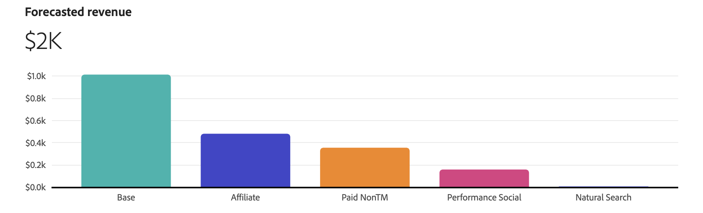

# Planejar insights

Em [!UICONTROL Plan insights], os insights do seu plano são criados, mostrando o [!UICONTROL Model], o [!UICONTROL Data range] e o [!UICONTROL Plan target] no qual o plano se baseia.

Quando os insights forem criados, você verá uma visão geral do seu plano, que consiste em:

- Um cabeçalho que exibe o [!UICONTROL Model], o [!UICONTROL Data range] e o [!UICONTROL Plan target] no qual o plano se baseia.
   - Caso tenha definido um plano baseado em metas, um selo indicará o status do público-alvo As opções possíveis são:

      - [!BADGE Meta atingível]{type=Positive}
      - [!BADGE Destino inatingível]{type=Negative}

   - Selecione  **[!UICONTROL Show more]** para mostrar mais detalhes.

- [Visualização [!UICONTROL Forecasted paid channel ROI]](#forecasted-paid-channel-spend-and-roi)
- [Visualização [!UICONTROL Forecasted revenue]](#forecasted-revenue)
- [Visualização [!UICONTROL Forecasted conversion]](#forecasted-conversions)
- [Visualização [!UICONTROL Marginal channel return]](#marginal-channel-return)
- Tabela [[!UICONTROL Data range breakdown] do plano](#date-range-breakdown), mostrando colunas para

   - Canal
   - ROI
   - CPA
   - Receita
   - Meta de conversão
   - Gastos

Para fechar a interface, selecione **[!UICONTROL Close]**.

Para alterar como visualizar o ROI do seu plano, selecione **[!UICONTROL X]** ou **[!UICONTROL &#x200B; %]** em **[!UICONTROL View ROI]**.

## Gastos e ROI previstos do canal pago

Essa visualização mostra um gráfico de dispersão para o gasto previsto e o retorno do investimento em seus canais pagos, com base no modelo, intervalo de datas e orçamento.

## Receita prevista

Essa visualização de gráfico de barras mostra a receita prevista para seus canais com base no modelo, intervalo de datas e orçamento.

## Conversões previstas

Essa visualização de gráfico de barras mostra as conversões previstas para seus canais com base no modelo, intervalo de datas e orçamento.

## Retorno de canal marginal

Esta visualização de gráfico de linhas mostra uma curva de retorno marginal para o canal selecionado com indicadores para **[!UICONTROL Marginal break-even]** e **[!UICONTROL Return point]**. Essa visualização ajuda você a entender como o gasto para um canal impede de atingir um ponto de equilíbrio marginal. E se você tem espaço para aumentar os gastos em um canal ou se deve gastar menos em um canal para melhorar a eficiência dos gastos do canal.

Para selecionar um canal específico para a visualização, selecione um canal no menu suspenso **[!UICONTROL View]**.

## Sinergias de canal

A Matriz de sinergias de canal ajuda a identificar como os canais de marketing interagem para criar efeitos multiplicativos, além de suas contribuições individuais.

Para baixar um arquivo CSV que representa a matriz, selecione  **[!UICONTROL Download]**.

## Detalhamento do intervalo de datas

A tabela [!UICONTROL Date range breakdown] mostra dados detalhados granulares por canal para [!UICONTROL ROI], [!UICONTROL Revenue], [!UICONTROL CPA], [!UICONTROL Conversions] e [!UICONTROL Spend].

1. Para baixar um arquivo CSV contendo os dados do detalhamento de intervalo de datas, selecione  **[!UICONTROL Download CSV]**. No menu de contexto:

   - Selecione  **[!UICONTROL Detailed CSV]** para obter dados detalhados em formato CSV.
   - Selecione  **[!UICONTROL Summary CSV]** para dados de resumo em formato CSV.

   Dados detalhados são dados granulares registrados por semana. Os dados de resumo são dados digitados pelo intervalo de datas fornecido pelo modelo.

1. Para exibir o detalhamento de Intervalo de datas por categoria de canais, selecione **[!UICONTROL All channels]**, **[!UICONTROL Paid channels]** ou **[!UICONTROL Non-paid channels]** na seleção **[!UICONTROL View]**.

## Editar plano

Para editar seu plano, selecione  **[!UICONTROL Edit plan]**.

1. Na seção **[!UICONTROL Spend selection]**, para cada intervalo de datas do orçamento, use a  para abrir a exibição de distribuição de canal para esse intervalo de dados.

   Você pode usar dados de referência históricos se quiser usar dados e insights passados de gastos com marketing. Considerar dados históricos de referência para:

   - Melhore a alocação de orçamento destacando canais de alto desempenho e canais de baixo desempenho.
   - Suporte para análise de tendências.
   - Identifique estratégias eficazes e evite erros ao configurar planos.

   Se você selecionar um período de referência histórico, será possível alinhar-se às preferências de padrão de gasto anteriores e a funcionalidade de planejamento do Mix Modeler poderá gerar planos que estejam dentro de suas expectativas. Esses planos devem, em última análise, aumentar a confiança das partes interessadas, garantir que os planos de marketing sejam estratégicos e eficientes e que estejam baseados em dados de desempenho comprovados e nas necessidades comerciais.

   

   1. Selecione o **[!UICONTROL Spend pattern]**.

      - A opção padrão é **[!UICONTROL Automatic]**.
      - Selecione **[!UICONTROL Historical reference]** e insira um **[!UICONTROL Start date]** para fazer referência a dados de gastos com marketing anteriores já disponíveis para o Mix Modeler. O **[!UICONTROL End date]** é determinado automaticamente com base no intervalo de dados selecionado. A data de início proposta é a primeira disponível de dados anteriores de gastos com marketing. Para indicar que você selecionou um período de referência histórica não existente, você vê um .

   1. Para modificar os orçamentos de cada canal, modifique os valores de **[!UICONTROL Min]** e **[!UICONTROL Max]** ou use os controles deslizantes.

   1. Para alternar entre entrada de moeda ou porcentagem, selecione **[!UICONTROL $]** ou **[!UICONTROL %]** para **[!UICONTROL View spend by]**.

   1. Para editar os detalhes do seu plano, selecione **[!UICONTROL Edit details]**:

      1. Na seção **[!UICONTROL Setup]**:

         1. Digite um **[!UICONTROL Plan name]**, por exemplo `Demo plan`. Digite um **[!UICONTROL Description]**, por exemplo `Demo plan for Luma company`.
         1. Selecione um **[!UICONTROL Model]** de **[!UICONTROL _Selecione uma opção._.]**

            

      1. Na seção **[!UICONTROL Goal]**, selecione a meta para a qual deseja otimizar seu plano. Você pode selecionar entre
         - **[!UICONTROL I have a budget to spend]**

           

           Essa opção permite inserir orçamentos para um ou mais intervalos de datas.

            1. No container **[!UICONTROL Optimize]**:
               1. Selecione uma conversão no menu suspenso **[!UICONTROL Select conversion]**.
               1. Selecione um modelo no menu suspenso **[!UICONTROL Select model]**.
            1. Especifique um **[!UICONTROL Date range]**, digitando datas ou selecionando um intervalo de datas usando .
            1. Insira um **[!UICONTROL Budget]**.
Para adicionar intervalos de datas adicionais, cada um com seu orçamento, selecione  **[!UICONTROL Add row]**.
Para excluir um intervalo de datas e o orçamento associado, selecione .
            1. Para definir um orçamento máximo opcional no qual você deseja restringir o plano:
               1. Ligar **[!UICONTROL Maximize budget]**.
               1. Especificar o valor do orçamento máximo. O valor deve ser igual ou superior ao valor total dos orçamentos especificados para os intervalos de datas.

         - **[!UICONTROL I have a target to achieve]** [!BADGE Beta]

           

            1. No container **[!UICONTROL Optimize]**
               1. Selecione uma conversão no menu suspenso **[!UICONTROL Select conversion]**.
               1. Selecione uma métrica de destino no menu suspenso **[!UICONTROL Select target metric]**. Você pode selecionar entre **[!UICONTROL Conversion]**, **[!UICONTROL CPA]**, **[!UICONTROL Revenue]** ou **[!UICONTROL ROI]**.
               1. Selecione um modelo no menu suspenso **[!UICONTROL Select model]**.
            1. Especifique um Intervalo de datas, digitando datas ou selecionando um intervalo de datas usando .
            1. Insira um valor para a métrica de destino selecionada. Por exemplo, um número para **[!UICONTROL Conversion]**, uma porcentagem para **[!UICONTROL ROI]** ou valores de moeda para **[!UICONTROL CPA]** e **[!UICONTROL Revenue]**.
Para adicionar intervalos de datas adicionais, cada um com sua métrica de destino, selecione  **[!UICONTROL Add row]**.
Para excluir um intervalo de datas e uma métrica de destino associada, selecione .
            1. Para definir um orçamento máximo opcional no qual você deseja restringir o plano:
               1. Ligar **[!UICONTROL Maximize budget]**.
               1. Especificar o valor do orçamento máximo.

         1. Selecione **[!UICONTROL Next]** para retornar à seção **[!UICONTROL Spend selection]**.

1. Na seção **[!UICONTROL Advanced configuration]**:

   

   - O nome do plano, o modelo, a faixa de datas e o orçamento total são resumidos.

   - Por padrão, o Mix Modeler calcula automaticamente a receita média por conversão usando os dados sazonais históricos mais recentes. Em **[!UICONTROL Average Revenue per conversion]** você pode definir uma receita média específica por conversão.

   1. Para cada faixa de datas no orçamento:
      1. Selecione um intervalo de datas no menu suspenso **[!UICONTROL Date range]**.
      1. Insira um valor de **[!UICONTROL Average revenue]**.
   1. Selecione . Adicione uma receita média personalizada por unidade de conversão para adicionar um intervalo de datas.
   1. Selecione  para remover um intervalo de datas.

   >[!NOTE]
   >
   >Se o seu modelo não incluir dados históricos de receita, você deverá definir uma receita média por conversão para cada faixa de datas especificada para o seu orçamento.
   >

   - Por padrão, o Mix Modeler calcula automaticamente os custos do canal usando os dados sazonais históricos mais recentes. Em **[!UICONTROL Channel costs]** você pode definir custos de canal personalizados.

   1. Para cada canal no modelo, defina o custo do canal personalizado.
      1. Selecione um canal no menu suspenso **[!UICONTROL Channel]**.
      1. Para cada faixa de datas no orçamento:
         1. Selecione um intervalo de datas no menu suspenso **[!UICONTROL Date range]**.
         1. Insira um valor de **[!UICONTROL Average revenue]**.
      1. Selecione  **[!UICONTROL Add custom average revenue per conversion unit]** para adicionar um intervalo de datas.
      1. Selecione  para remover um intervalo de datas.

   1. Selecione  **[!UICONTROL Add custom channel cost]** para adicionar um canal.
   1. Selecione  para remover um canal personalizado.

1. Quando terminar de editar o plano, selecione **[!UICONTROL Edit]**.

   Na caixa de diálogo **[!UICONTROL All changes are final]**, selecione **[!UICONTROL OK]** para atualizar a alocação de gastos atual do plano e as previsões de ROI e receita. Selecione **[!UICONTROL Cancel]** para cancelar a atualização do seu plano.

- Para cancelar as atualizações do plano a qualquer momento, selecione **[!UICONTROL Cancel]**. Na caixa de diálogo **[!UICONTROL No work will be saved]**, selecione **[!UICONTROL Cancel]** para continuar a trabalhar no seu plano ou selecione **[!UICONTROL OK]** para retornar à interface Planos.
- Para voltar ao assistente, selecione **[!UICONTROL Back]**.
